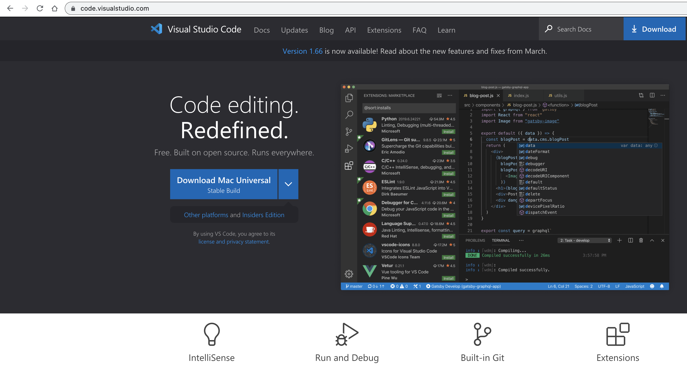
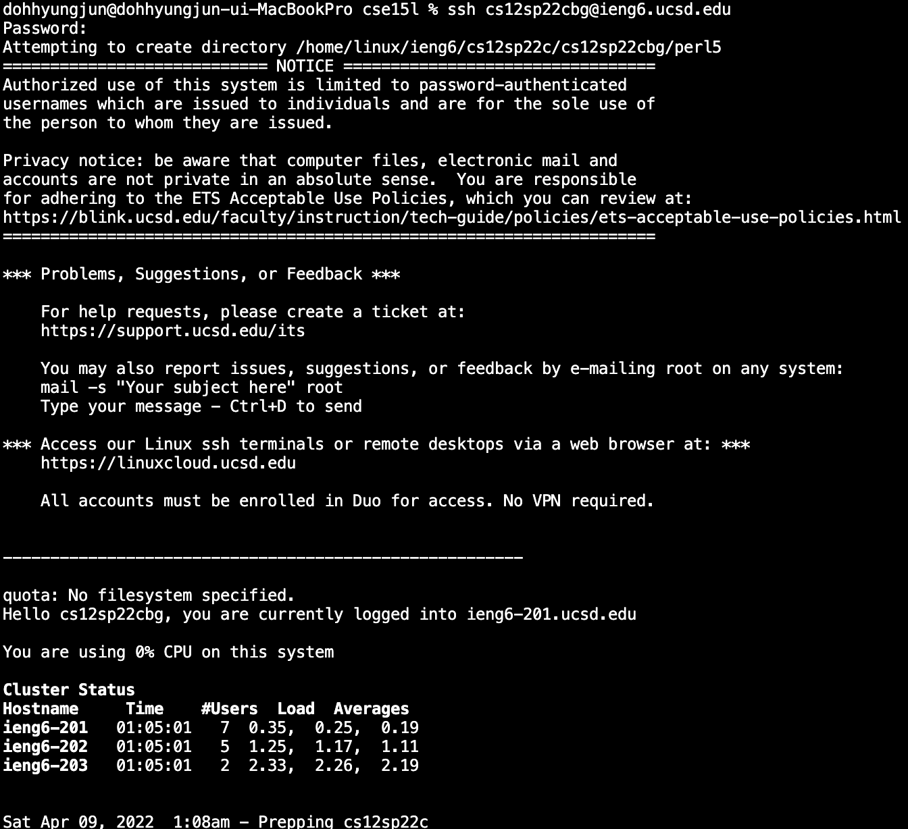
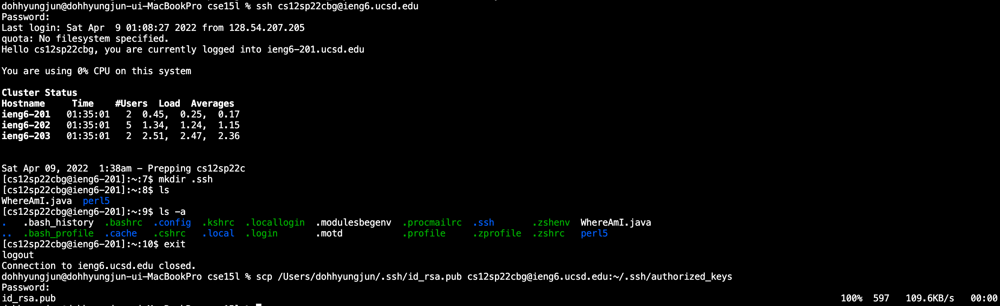

# Hyungjun Doh's Week 2 Lab Report
For incoming 15L students (and future myself), please follow the instructions as if you are my avatar.  
In this lab report, you would see how I did to "remote access."  

Since I used ***cs15lsp22agb*** for initial labs, in this report, I would use ***cs12sp22cbg***.

* Installing VSCode  
VSCode is Integrated Development Environment where you can open files, code, etc.  
I followed the link and pressed the download button.  
[link to download VSCode] https://code.visualstudio.com/  

* Remotely Connecting  
I opened my terminal and pressed the following code.
    > ``ssh cs12sp22cbg@ieng6.ucsd.edu  ``

    Then, it resulted as following.

    

    **cs12sp22cgb** and **cse15lsp22agb** is email given by UCSD for CSE12 and CSE 15L.  
    **ieng6.ucsd.edu** is the environment I wanted to get access.  
    ``ssh`` allows network access from my environment to remote environment(ieng6.ucsd.edu).

* Trying Some Commands  
    Then I tried some commands, such as ``pwd``, ``ls``, ``ls -a``, ``ls -lat``
    

    Here are more commands and explanations.  
    [``-lat``] is a combination of [``-l``][``-a``][``-t``] which is “list all time”
    It also works regardless of the ordering.
    [``-t``] only works with [``-l``] since the documents need to be listed first to order them with time.  
    [``pwd``] Print Working Directory  
    [``cp``] copy  
    [``cat``] Show contents of a file.

* Moving Files with ``scp``  
Since I tried some commands, now I will try on modifing the environment by remote commands. I will try ``scp`` which is a command that move files.  ``scp`` works like following:  
``scp``  ***what*** ***where*** 

    > ``scp WhereAmI.java cs12sp22cbg@ieng6.ucsd.edu:~/``

  
    

* Setting an SSH Key  
Now try reloging in! You would have to press the long password again! This would happen every time you want to get access to the environemnt. **Very Handy**  
Now I set up an SSH key to avoid this numerous time waste.  I will start from making a SSH key. Since, I already have a SSH key I would have one step more.
    > ``ssh-keygen``

    
    Ignore the part id_rsa already exists.
    Now that we have the RSA-key, we need to share  this with a remote server.

    1. Log-in again to a remote environment.
        > ``ssh cs12sp22cbg@ieng6.ucsd.edu``
    2. Make directory after logging in, then exit
        > ``mkdir .ssh``  
        > ``exit``
    3. Put your own **user name** for following instructions. (Remark! this should in one line!)
        > ``scp /Users/dohhyungjun/.ssh/id_rsa.pub cs12sp22cbg@ieng6.ucsd.edu:~/.ssh/authorized_keys``
    
    
   
* Optimizing Remote Running  
    Now that we *optimized* on loging in by passing putting in the password phaze, I will show you a different way of optimizing. ``;`` command key would allow to write multiple lines into one. Here's an example:  

        > ``javac WhereAmI.java;java WhereAmI.java`` 
    This would help you, debugging the java file and run it in the same time.
    This also works in remote environment. See the image provided.  
    

This is the end of my report, hope you had fun!
